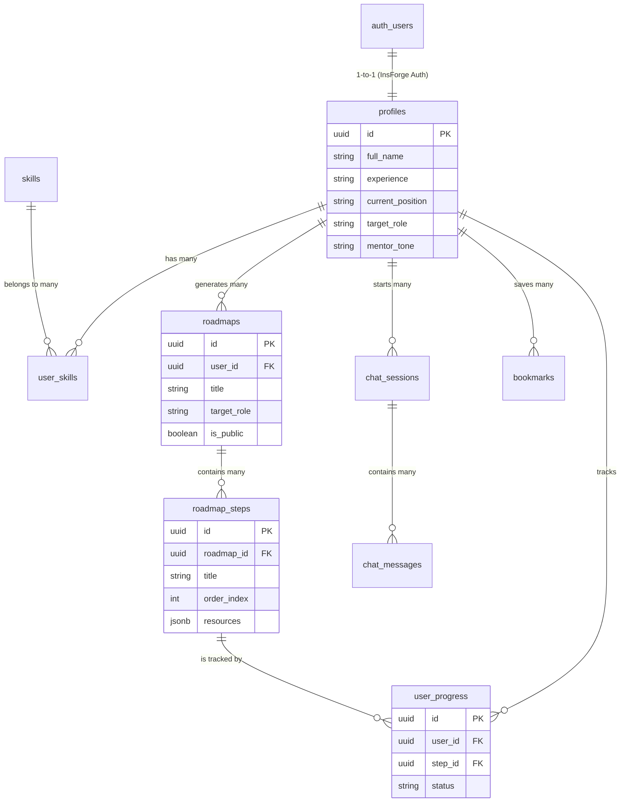

# 🗄️ TruthMentor Database Architecture & Schema

> **Why this document?**
> A strong backend starts with a solid database schema. This document visualizes the exact database structure we built for TruthMentor, explains *why* each table exists, and how data flows through the application.

---

## 🗺️ 1. Visualizing the Relationships (Entity-Relationship Diagram)

Below is the visual map of how all our tables connect. 
*Note: `profiles` is the center of the universe because everything belongs to a user.*



---

## 🏗️ 2. Why We Built It This Way (Table by Table Breakdown)

When designing a database, every table must solve a specific business problem. Here is why we created each of the 9 tables:

### 👤 Identity & User Profiling
**1. `profiles`**
- **What it is:** The core user table containing public and app-specific info.
- **Why it exists:** InsForge (like Supabase) has a hidden `auth.users` table for emails and passwords. We cannot easily modify that hidden table. So, we create `profiles` and link it 1-to-1 with the auth table. It stores the context the AI needs (like their `experience` level and `mentor_tone`).

### 🧠 Skills Mapping
**2. `skills`**
- **What it is:** A master dictionary of all tech skills (React, Python, AWS, etc.).
- **Why it exists:** We don't want users typing "react", "ReactJS", and "REACT" as different things. Having a master table keeps data clean and allows us to categorize skills (Frontend vs Backend).

**3. `user_skills` (The Junction Table)**
- **What it is:** A bridge connecting `profiles` and `skills`.
- **Why it exists:** A user has many skills, and a skill belongs to many users (a Many-to-Many relationship). In SQL, you solve Many-to-Many relationships by putting a "Junction Table" in the middle. It also lets us store *how good* the user is at that specific skill (e.g., User A knows React at an 'expert' level).

### 🗺️ Core Feature: Career Roadmaps
**4. `roadmaps`**
- **What it is:** The top-level container for an AI-generated learning path.
- **Why it exists:** If a user asks "How do I become a DevOps engineer?", the AI generates a full plan. We store the overarching plan here so the user can look back at it months later.

**5. `roadmap_steps`**
- **What it is:** The individual milestones inside a roadmap (e.g., Step 1: Learn Linux, Step 2: Learn Docker).
- **Why it exists:** Why didn't we just save the whole AI response as one big block of text? **Because you can't track progress on a text block.** By breaking the roadmap into separate rows (steps), the UI can render them as individual checkboxes or timeline nodes.

**6. `user_progress`**
- **What it is:** Tracks which steps the user has completed.
- **Why it exists:** We separate the *Step* from the *Progress*. If User A and User B are following the same public roadmap, they have different progress. This table links a `user_id` to a `step_id` with a status of `completed` or `in_progress`.

### 💬 Core Feature: Honest AI Mentor
**7. `chat_sessions`**
- **What it is:** A grouping for a specific conversation.
- **Why it exists:** If a user talks to the AI on Monday about "Resumes" and on Friday about "React", those are different contexts. This table acts like the sidebar in ChatGPT, letting users switch between different conversations.

**8. `chat_messages`**
- **What it is:** The actual texts sent back and forth.
- **Why it exists:** To give the AI "Memory". Before we send a new message to the AI, we fetch the last 5 messages from this table so the AI remembers what you were just talking about.

### 📚 Utilities
**9. `bookmarks`**
- **What it is:** A place to save links.
- **Why it exists:** The AI will recommend courses, YouTube videos, and articles. The user needs a place to save them so they don't get lost in the chat history.

---

## 🔒 3. The "Why" behind Row Level Security (RLS)

In a traditional app (like your old Express backend), the Node.js server checks if a user is allowed to see data before sending it. 

With InsForge, the frontend can query the database *directly*. This is incredibly fast, but dangerous. What stops a hacker from writing:
`insforge.database.from('profiles').select('*')` and downloading everyone's data?

**The Solution: Row Level Security (RLS).**
We added SQL policies to the database itself that say: *"Even if someone asks for all rows, only return the rows where `user_id` matches the currently logged-in user."*

This is why we wrote lines like this in our migration:
```sql
CREATE POLICY profiles_select ON profiles FOR SELECT USING (auth.uid() = id);
```
It ensures the database is mathematically secure at the lowest possible level.
